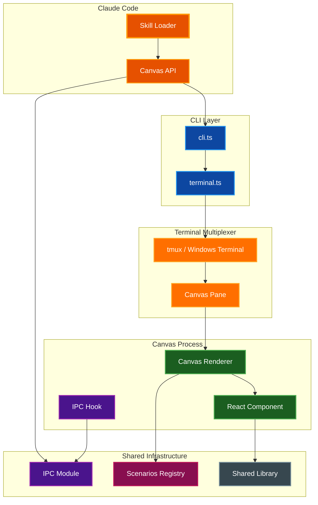
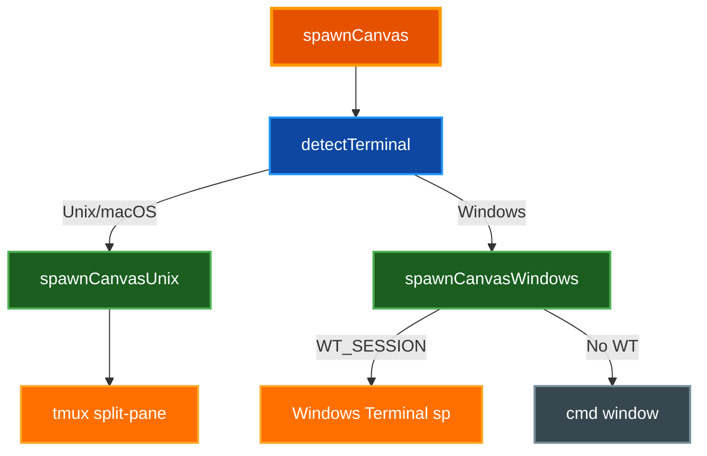
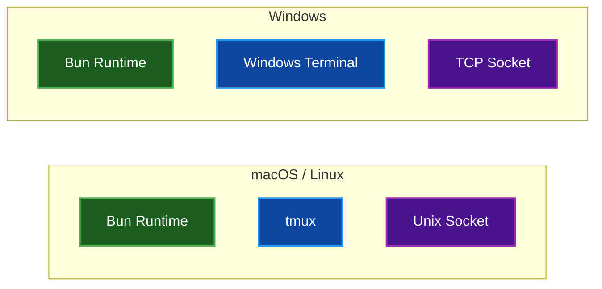
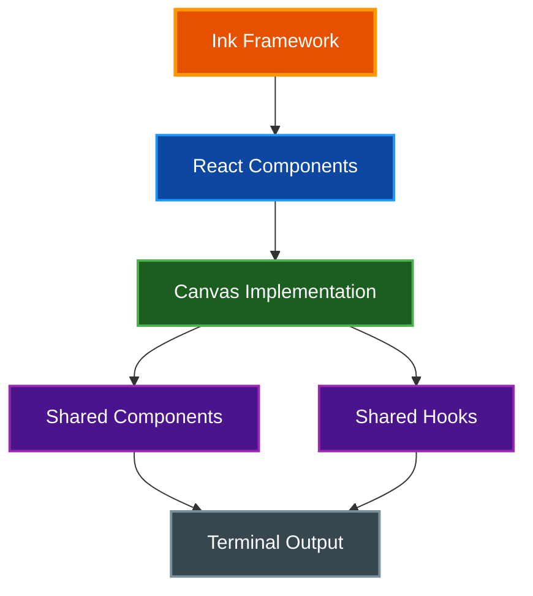
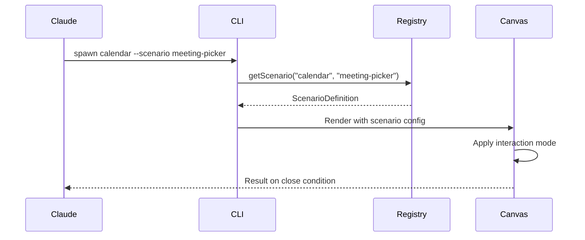
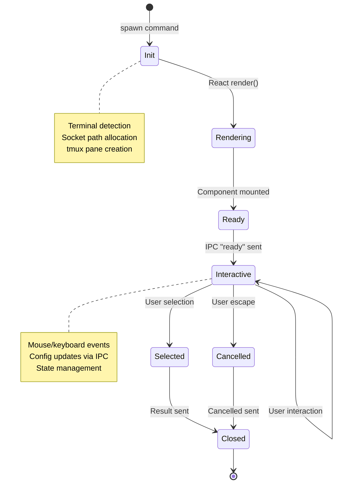
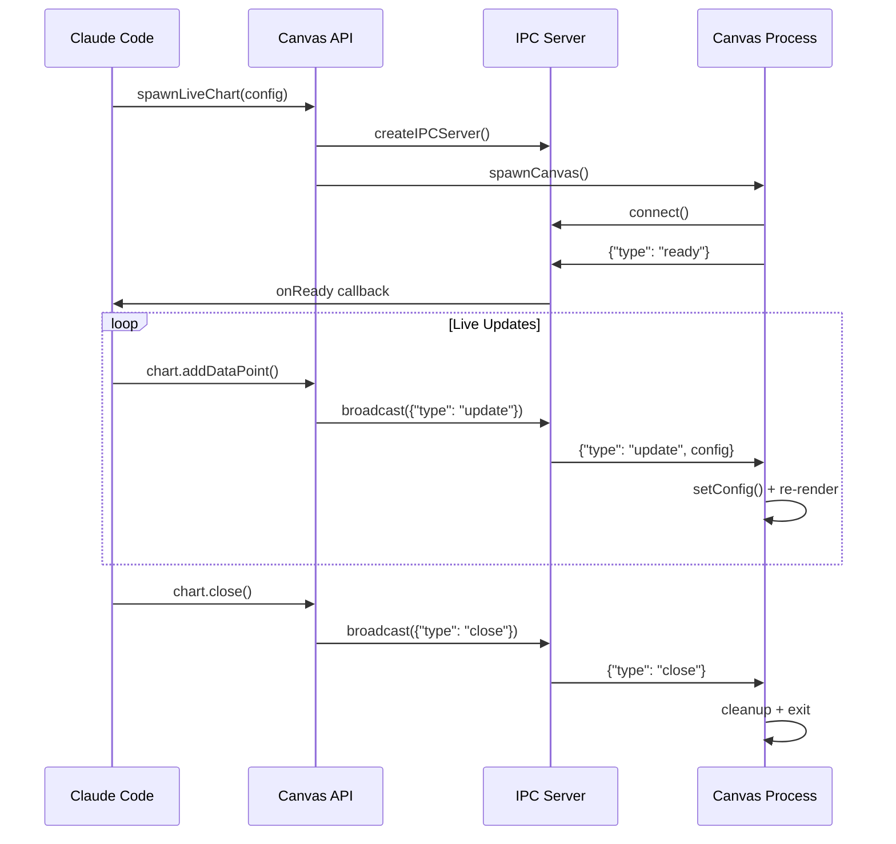
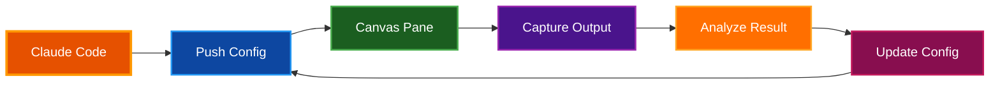

# Architecture

Claude Canvas is a TUI toolkit that provides Claude Code with its own display through interactive terminal interfaces spawned in tmux panes.

## Table of Contents

- [Overview](#overview)
- [System Architecture](#system-architecture)
- [Core Components](#core-components)
- [Runtime Environment](#runtime-environment)
- [Rendering Pipeline](#rendering-pipeline)
- [Scenario System](#scenario-system)
- [Shared Component Library](#shared-component-library)
- [Plugin Integration](#plugin-integration)
- [Data Flow](#data-flow)
- [Related Documentation](#related-documentation)

## Overview

**Purpose:** Enable Claude Code to spawn and control interactive terminal displays for data visualization, user input, and complex interactions that require dedicated screen real estate.

**Key Architectural Principles:**

- Cross-platform support (macOS/Linux via tmux, Windows via Windows Terminal)
- Real-time bidirectional communication via IPC sockets
- React/Ink-based rendering for composable TUI components
- Scenario-based interaction modes for different use cases
- Shared component library for consistent UI patterns

## System Architecture



## Core Components

### CLI Entry Point

The CLI (`cli.ts`) serves as the command dispatcher, handling canvas spawning, display, and IPC operations.

| Command | Purpose |
|---------|---------|
| `show [kind]` | Render canvas in current terminal |
| `spawn [kind]` | Spawn canvas in new tmux/WT pane |
| `capture` | Capture canvas pane output (Terminal Vision) |
| `update <id>` | Send config update via IPC |
| `selection <id>` | Get selection from document canvas |
| `content <id>` | Get content from document canvas |
| `env` | Show detected terminal environment |

### Terminal Manager

The terminal module (`terminal.ts`) handles cross-platform terminal detection and canvas spawning.



**Key Features:**

- **Pane Reuse**: Tracks canvas pane ID to reuse existing panes instead of creating new splits
- **Terminal Vision**: Captures canvas output via `tmux capture-pane` for AI feedback loops
- **Cross-Platform**: Unix sockets on macOS/Linux, TCP on Windows

### Canvas Renderer

The renderer (`canvases/index.tsx`) routes canvas kinds to their respective React components.

```typescript
export async function renderCanvas(
  kind: string,        // Canvas type identifier
  id: string,          // Instance ID for IPC
  config?: unknown,    // JSON configuration
  options?: RenderOptions
): Promise<void>
```

**Rendering Process:**

1. Clear screen and hide cursor
2. Register exit handlers (show cursor on exit)
3. Route to appropriate canvas component based on `kind`
4. Render using Ink's `render()` function
5. Wait for component to exit

### IPC Module

The IPC system enables bidirectional communication between Claude Code and canvas processes.

| Component | Location | Purpose |
|-----------|----------|---------|
| Types | `ipc/types.ts` | Message definitions, platform detection |
| Server | `ipc/server.ts` | Canvas-side listener |
| Client | `ipc/client.ts` | Controller-side connector |

**Socket Path Convention:**

- **Unix**: `/tmp/canvas-{id}.sock`
- **Windows**: Port stored in `%TEMP%\canvas-{id}.port`

> **Note:** See [IPC.md](./IPC.md) for detailed IPC documentation.

## Runtime Environment

### Platform Support



| Requirement | macOS/Linux | Windows |
|-------------|-------------|---------|
| Runtime | Bun | Bun |
| Multiplexer | tmux | Windows Terminal |
| IPC Transport | Unix socket | TCP (localhost) |
| Pane Splitting | `tmux split-window` | `wt.exe sp` |

### Environment Detection

```typescript
interface TerminalEnvironment {
  inTmux: boolean;           // TMUX env var present
  inWindowsTerminal: boolean; // WT_SESSION env var present
  platform: "windows" | "unix";
  summary: string;           // Human-readable description
}
```

## Rendering Pipeline

### Component Stack



**Ink Framework Features:**

- React-based terminal rendering
- Box model layout (flexbox-like)
- Text styling (colors, bold, etc.)
- Built-in input handling (`useInput`)
- Stdout dimension tracking (`useStdout`)

### Mouse Input Processing

Mouse events are parsed from SGR extended mode escape sequences:

```
\x1b[<btn;x;y[Mm]
```

| Field | Description |
|-------|-------------|
| `btn` | Button code with modifiers |
| `x`, `y` | Cursor coordinates |
| `M` | Press event |
| `m` | Release event |

**Button Code Bits:**

| Bit | Meaning |
|-----|---------|
| 0-1 | Button (0=left, 1=middle, 2=right) |
| 2 | Shift modifier |
| 3 | Meta modifier |
| 4 | Ctrl modifier |
| 5 | Motion event |
| 6 | Scroll event |

## Scenario System

Scenarios define interaction modes for canvases, controlling behavior, result types, and close conditions.

### Scenario Definition

```typescript
interface ScenarioDefinition<TConfig, TResult> {
  name: string;
  description: string;
  canvasKind: string;
  interactionMode: "view-only" | "selection" | "multi-select";
  closeOn: "selection" | "escape" | "command" | "never";
  autoCloseDelay?: number;
  defaultConfig: Partial<TConfig>;
}
```

### Scenario Registry

Scenarios are registered in the central registry with keys formatted as `{canvasKind}:{scenarioName}`:

```typescript
// Example registrations
registry.set("calendar:display", displayScenario);
registry.set("calendar:meeting-picker", meetingPickerScenario);
registry.set("document:edit", documentEditScenario);
```

**Lookup:**

```typescript
const scenario = getScenario("calendar", "meeting-picker");
```

### Scenario Flow



## Shared Component Library

### Module Structure

```
shared/
├── components/     # Reusable UI components
│   ├── Chart.tsx   # Bar, line, pie, gauge, sparkline
│   ├── DataTable.tsx # Sortable, filterable table
│   ├── Form.tsx    # Input controls
│   └── Layout.tsx  # Panel, tabs, modal, accordion
├── hooks/          # React hooks
│   └── index.ts    # All hooks in single file
├── types/          # TypeScript definitions
│   └── index.ts    # Shared type definitions
└── utils/          # Helper functions
    └── index.ts
```

### Shared Hooks

| Category | Hooks |
|----------|-------|
| **Terminal** | `useTerminalSize`, `useExit` |
| **Mouse** | `useMouse`, `useGridMouse` |
| **Navigation** | `useNavigation`, `useListNavigation` |
| **Focus** | `useFocus`, `useFocusManager` |
| **Form** | `useForm` |
| **Data** | `useSort`, `useFilter`, `usePagination` |
| **Selection** | `useSelection` |
| **Timer** | `useInterval`, `useTimeout`, `useCountdown` |
| **Async** | `useAsync` |
| **Clipboard** | `useClipboard` |

### Shared Types

The type system covers common domain entities:

| Domain | Types |
|--------|-------|
| Core | `Dimensions`, `Position`, `Range`, `DateRange` |
| Data | `Column`, `SortConfig`, `FilterConfig`, `PaginationConfig` |
| Forms | `FormField`, `SelectOption`, `ValidationRule`, `FormState` |
| Charts | `ChartType`, `DataPoint`, `DataSeries`, `ChartConfig` |
| Layout | `LayoutType`, `LayoutConfig`, `TabConfig` |
| Business | `KanbanColumn`, `KanbanCard`, `Deal`, `PipelineStage` |
| Finance | `Money`, `LineItem`, `Invoice`, `Budget`, `Transaction` |
| Travel | `Hotel`, `RoomType`, `Itinerary`, `ItineraryDay` |
| Project | `Project`, `Task`, `Milestone`, `Workflow` |
| IoT | `Device`, `DeviceState`, `Automation` |
| Fitness | `Workout`, `Exercise`, `Meal`, `Habit` |
| Media | `MediaItem`, `Playlist`, `Event`, `Venue` |
| AI | `Agent`, `AgentLog`, `AgentMetrics`, `Memory` |

## Plugin Integration

### Directory Structure

```
canvas/
├── src/
│   ├── cli.ts              # CLI entry point
│   ├── terminal.ts         # Terminal detection, spawning
│   ├── canvases/           # Canvas implementations
│   ├── scenarios/          # Scenario definitions
│   ├── ipc/                # IPC server/client
│   ├── api/                # High-level API
│   └── shared/             # Component library
├── skills/                 # Skill documentation
│   ├── canvas/SKILL.md     # Main skill
│   ├── calendar/SKILL.md
│   ├── document/SKILL.md
│   └── ...
├── commands/               # User commands
│   └── canvas.md
├── run-canvas.sh           # Unix launcher
├── run-canvas.cmd          # Windows launcher
└── package.json
```

### Marketplace Registration

The plugin is registered in the marketplace manifest:

```json
{
  "name": "claude-canvas",
  "plugins": [{
    "name": "canvas",
    "source": "./canvas",
    "description": "Spawn and control interactive terminal displays"
  }]
}
```

### Skill Loading

Claude Code loads skills from `skills/*/SKILL.md` files with YAML frontmatter:

```yaml
---
name: canvas
description: |
  The primary skill for terminal TUI components...
---
```

## Data Flow

### Canvas Lifecycle



### Configuration Update Flow



### Terminal Vision Flow



**Terminal Vision** enables Claude to "see" canvas output without user screenshots:

1. **Push config** to canvas via IPC
2. **Capture output** using `tmux capture-pane`
3. **Analyze** the rendered text for issues
4. **Update config** to fix layout problems
5. **Repeat** until rendering is correct

## Related Documentation

- [IPC.md](./IPC.md) - Inter-process communication patterns
- [README.md](../README.md) - Project overview and canvas types
- [Canvas SKILL.md](../canvas/skills/canvas/SKILL.md) - Usage documentation
