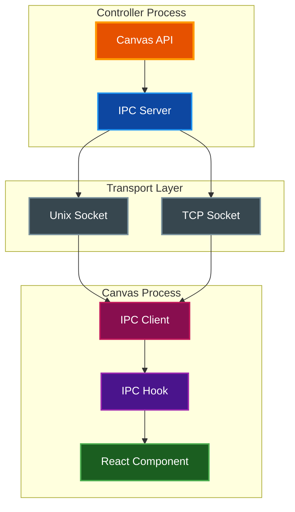
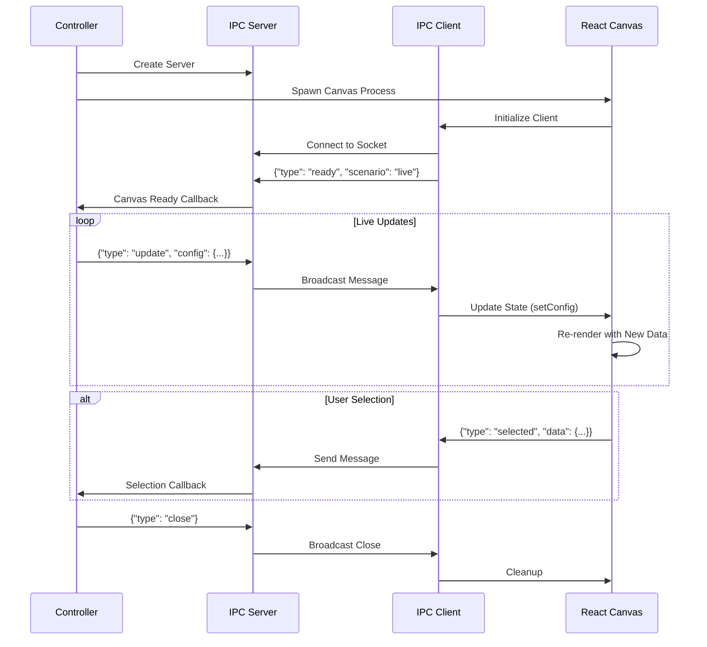
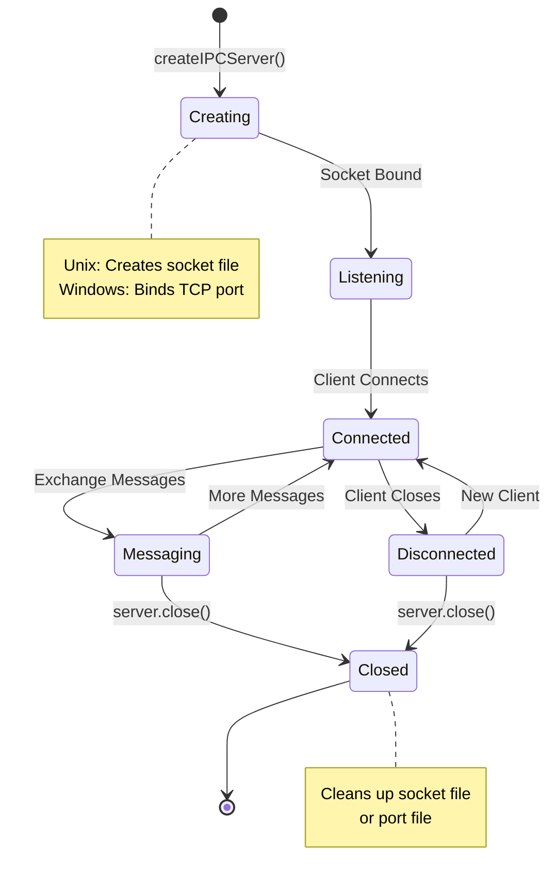

# IPC (Inter-Process Communication)

Real-time bidirectional communication between canvas components and controllers using Unix domain sockets (macOS/Linux) or TCP sockets (Windows).

## Table of Contents

- [Overview](#overview)
- [Architecture](#architecture)
- [Message Protocol](#message-protocol)
- [Cross-Platform Support](#cross-platform-support)
- [Server Implementation](#server-implementation)
- [Client Implementation](#client-implementation)
- [Live Data Patterns](#live-data-patterns)
- [React Hook Pattern](#react-hook-pattern)
- [Troubleshooting](#troubleshooting)
- [Related Documentation](#related-documentation)

## Overview

**Purpose:** Enable real-time communication between spawned canvas processes and their controlling applications for dynamic updates, user interactions, and state synchronization.

**Key Features:**

- Bidirectional JSON-based messaging over sockets
- Cross-platform support (Unix sockets on macOS/Linux, TCP on Windows)
- Automatic reconnection with retry logic
- Newline-delimited JSON (NDJSON) protocol
- Support for live streaming data updates

**When to Use IPC:**

- Live-updating charts with streaming data
- Dynamic configuration changes to running canvases
- User selection feedback from interactive components
- Health monitoring via ping/pong heartbeats

## Architecture

### System Overview



### Data Flow



## Message Protocol

All messages are JSON objects, newline-delimited (NDJSON). Each message ends with `\n`.

### Controller to Canvas Messages

| Type | Description | Payload |
|------|-------------|---------|
| `update` | Update canvas configuration | `{ type: "update", config: {...} }` |
| `close` | Request canvas to close | `{ type: "close" }` |
| `ping` | Health check request | `{ type: "ping" }` |
| `getSelection` | Request current selection | `{ type: "getSelection" }` |
| `getContent` | Request full content | `{ type: "getContent" }` |

```typescript
type ControllerMessage =
  | { type: "close" }
  | { type: "update"; config: unknown }
  | { type: "ping" }
  | { type: "getSelection" }
  | { type: "getContent" };
```

### Canvas to Controller Messages

| Type | Description | Payload |
|------|-------------|---------|
| `ready` | Canvas initialized | `{ type: "ready", scenario: "view" }` |
| `selected` | User made selection | `{ type: "selected", data: {...} }` |
| `cancelled` | User cancelled | `{ type: "cancelled", reason?: "..." }` |
| `error` | Error occurred | `{ type: "error", message: "..." }` |
| `pong` | Health check response | `{ type: "pong" }` |
| `selection` | Selection data response | `{ type: "selection", data: {...} }` |
| `content` | Content data response | `{ type: "content", data: {...} }` |

```typescript
type CanvasMessage =
  | { type: "ready"; scenario: string }
  | { type: "selected"; data: unknown }
  | { type: "cancelled"; reason?: string }
  | { type: "error"; message: string }
  | { type: "pong" }
  | { type: "selection"; data: { selectedText: string; startOffset: number; endOffset: number } | null }
  | { type: "content"; data: { content: string; cursorPosition: number } };
```

## Cross-Platform Support

### Platform Detection

```typescript
import { tmpdir } from "node:os";
import { join } from "node:path";

const isWindows = process.platform === "win32";
```

### Socket Paths

| Platform | Transport | Path Format |
|----------|-----------|-------------|
| macOS/Linux | Unix socket | `/tmp/canvas-{id}.sock` |
| Windows | TCP | `127.0.0.1:{port}` (port stored in `%TEMP%\canvas-{id}.port`) |

```typescript
function getSocketPath(id: string): string {
  if (isWindows) {
    return join(tmpdir(), `canvas-${id}.sock`);
  }
  return `/tmp/canvas-${id}.sock`;
}

function getPortFilePath(id: string): string {
  return join(tmpdir(), `canvas-${id}.port`);
}
```

### Connection Info

```typescript
interface ConnectionInfo {
  type: "unix" | "tcp";
  socketPath?: string;  // For Unix sockets
  host?: string;        // For TCP (default: 127.0.0.1)
  port?: number;        // For TCP
}

async function getConnectionInfo(id: string): Promise<ConnectionInfo> {
  if (isWindows) {
    const portFile = getPortFilePath(id);
    const port = parseInt(await Bun.file(portFile).text(), 10);
    return { type: "tcp", host: "127.0.0.1", port };
  }
  return { type: "unix", socketPath: getSocketPath(id) };
}
```

## Server Implementation

The IPC server runs on the controller side (e.g., Claude Code) and accepts connections from spawned canvas processes.

### Creating a Server

```typescript
import { createIPCServer } from "./ipc/server";

const server = await createIPCServer({
  socketPath: "/tmp/canvas-my-chart.sock",

  onClientConnect() {
    console.log("Canvas connected");
  },

  onMessage(msg) {
    switch (msg.type) {
      case "ready":
        console.log("Canvas ready with scenario:", msg.scenario);
        break;
      case "selected":
        console.log("User selected:", msg.data);
        break;
      case "cancelled":
        console.log("User cancelled");
        break;
      case "error":
        console.error("Canvas error:", msg.message);
        break;
    }
  },

  onClientDisconnect() {
    console.log("Canvas disconnected");
  },

  onError(error) {
    console.error("IPC error:", error);
  },
});

// Broadcast updates to all connected clients
server.broadcast({ type: "update", config: newConfig });

// Close server when done
server.close();
```

### Server Interface

```typescript
interface IPCServer {
  broadcast: (msg: CanvasMessage) => void;
  close: () => void;
  port?: number;  // Only set on Windows (TCP mode)
}
```

### Server Lifecycle



## Client Implementation

The IPC client runs on the canvas side and connects to the controller's server.

### Connecting to Controller

```typescript
import { connectToController, connectWithRetry } from "./ipc/client";

// Basic connection
const client = await connectToController({
  socketPath: "/tmp/canvas-my-chart.sock",

  onMessage(msg) {
    switch (msg.type) {
      case "update":
        handleConfigUpdate(msg.config);
        break;
      case "close":
        cleanup();
        break;
      case "ping":
        client.send({ type: "pong" });
        break;
    }
  },

  onDisconnect() {
    console.log("Disconnected from controller");
  },

  onError(error) {
    console.error("Connection error:", error);
  },
});

// Send messages to controller
client.send({ type: "ready", scenario: "live" });
client.send({ type: "selected", data: userSelection });

// Check connection status
if (client.isConnected()) {
  client.send({ type: "pong" });
}

// Close connection
client.close();
```

### Connection with Retries

```typescript
// Retry connection up to 10 times with 100ms delay
const client = await connectWithRetry(
  {
    socketPath: "/tmp/canvas-my-chart.sock",
    onMessage: handleMessage,
    onDisconnect: handleDisconnect,
  },
  10,   // maxRetries
  100   // retryDelayMs
);
```

### Client Interface

```typescript
interface IPCClient {
  send: (msg: ControllerMessage) => void;
  close: () => void;
  isConnected: () => boolean;
}
```

## Live Data Patterns

### Spawning a Live Chart

```typescript
import { spawnLiveChart } from "./api/canvas-api";

// Spawn chart with live update capability
const chart = await spawnLiveChart({
  title: "Live Sensor Data",
  chartType: "line",
  series: [
    { id: "temp", name: "Temperature", data: [], color: "red" },
    { id: "humidity", name: "Humidity", data: [], color: "blue" },
  ],
}, {
  onReady: () => console.log("Chart ready!"),
});

// Add data points dynamically
let time = 0;
const interval = setInterval(() => {
  chart.addDataPoint("temp", { x: time, y: 20 + Math.random() * 10 });
  chart.addDataPoint("humidity", { x: time, y: 40 + Math.random() * 20 });
  time++;
}, 1000);

// Update configuration
chart.update({ title: "Updated Title" });

// Close when done
setTimeout(() => {
  clearInterval(interval);
  chart.close();
}, 30000);

// Wait for close
const result = await chart.onClose;
console.log("Chart closed:", result);
```

### Live Chart Handle

```typescript
interface LiveChartHandle {
  update: (config: Partial<ChartConfig>) => void;
  addDataPoint: (seriesId: string, point: { x: number | string; y: number }) => void;
  close: () => void;
  onClose: Promise<CanvasResult<void>>;
}
```

### Data Streaming Flow


## React Hook Pattern

### Creating an IPC Hook

For React canvas components, create a custom hook that manages IPC connection and state updates.

```typescript
import { useState, useEffect, useRef } from 'react';

interface UseCanvasIpcOptions<TConfig, TResult> {
  socketPath?: string;
  scenario?: string;
  initialConfig: TConfig;
  onResult?: (result: TResult) => void;
}

interface UseCanvasIpcReturn<TConfig> {
  config: TConfig;
  isConnected: boolean;
}

export function useCanvasIpc<TConfig, TResult>({
  socketPath,
  scenario = 'view',
  initialConfig,
  onResult,
}: UseCanvasIpcOptions<TConfig, TResult>): UseCanvasIpcReturn<TConfig> {
  const [config, setConfig] = useState<TConfig>(initialConfig);
  const [isConnected, setIsConnected] = useState(false);
  const clientRef = useRef<{ send: Function; close: Function } | null>(null);

  useEffect(() => {
    if (!socketPath) return;

    let mounted = true;
    let buffer = '';

    const handleMessage = (msg: ControllerMessage) => {
      switch (msg.type) {
        case 'update':
          if (msg.config) {
            setConfig((prev) => ({
              ...prev,
              ...(msg.config as Partial<TConfig>),
            }));
          }
          break;

        case 'close':
          onResult?.({ action: 'close' } as TResult);
          break;

        case 'ping':
          clientRef.current?.send({ type: 'pong' });
          break;
      }
    };

    const connect = async () => {
      const socket = await Bun.connect({
        unix: socketPath,
        socket: {
          open(sock) {
            if (mounted) {
              setIsConnected(true);
              sock.write(JSON.stringify({ type: 'ready', scenario }) + '\n');
            }
          },
          data(sock, data) {
            buffer += data.toString();
            const lines = buffer.split('\n');
            buffer = lines.pop() || '';

            for (const line of lines) {
              if (line.trim()) {
                try {
                  const msg = JSON.parse(line);
                  handleMessage(msg);
                } catch {
                  // Ignore parse errors
                }
              }
            }
          },
          close() {
            if (mounted) setIsConnected(false);
          },
          error() {},
        },
      });

      if (mounted) {
        clientRef.current = {
          send(msg) { socket.write(JSON.stringify(msg) + '\n'); },
          close() { socket.end(); },
        };
      }
    };

    connect();

    return () => {
      mounted = false;
      clientRef.current?.close();
      clientRef.current = null;
    };
  }, [socketPath, scenario, onResult]);

  return { config, isConnected };
}
```

### Hook Usage in Component

```typescript
function LiveChart({ initialConfig, socketPath, scenario, onResult }) {
  // IPC hook manages connection and config state
  const { config, isConnected } = useChartIpc({
    socketPath,
    scenario,
    initialConfig,
    onResult,
  });

  // Viewport hook auto-updates when data bounds change
  const bounds = calculateBounds(config.series);
  const { viewport, pan, zoom, reset } = useViewport(bounds, config);

  return (
    <Box flexDirection="column">
      <Text>{config.title}</Text>
      <ChartArea series={config.series} viewport={viewport} />
      {isConnected && <Text color="green">Live</Text>}
    </Box>
  );
}
```

### Auto-Updating Viewport for Live Data

> **Tip:** When receiving live data updates, the viewport should automatically follow new data points. Use a `useEffect` that watches data bounds changes.

```typescript
function useViewport(dataBounds: Bounds, config: ChartConfig) {
  const [viewport, setViewport] = useState<Viewport>(() => initialViewport(dataBounds));
  const isFirstRender = useRef(true);
  const prevBoundsRef = useRef<Bounds | null>(null);

  // Auto-update viewport when data bounds change (for live data)
  useEffect(() => {
    if (isFirstRender.current) {
      isFirstRender.current = false;
      prevBoundsRef.current = dataBounds;
      return;
    }

    const prev = prevBoundsRef.current;
    prevBoundsRef.current = dataBounds;

    // Skip if bounds haven't changed
    if (prev && boundsEqual(prev, dataBounds)) return;

    // Update viewport to follow new data
    setViewport((v) => ({
      ...addPadding(dataBounds),
      zoomLevel: v.zoomLevel,
    }));
  }, [dataBounds, config]);

  // ... pan, zoom, reset functions

  return { viewport, pan, zoom, reset };
}
```

## Troubleshooting

### Common Issues

#### Issue: Canvas not receiving updates

**Symptom:** Config updates sent but canvas doesn't re-render

**Solution:** Ensure the IPC hook properly calls `setConfig` on update messages. Check that message parsing handles newline-delimited JSON correctly.

```typescript
// Wrong: Using complete JSON.parse on buffer
const msg = JSON.parse(buffer);

// Correct: Split by newlines first
const lines = buffer.split('\n');
for (const line of lines) {
  if (line.trim()) {
    const msg = JSON.parse(line);
  }
}
```

#### Issue: Socket file exists error (Unix)

**Symptom:** `EADDRINUSE` error when starting server

**Solution:** Clean up old socket files before creating server.

```typescript
import { existsSync, unlinkSync } from "fs";

if (existsSync(socketPath)) {
  unlinkSync(socketPath);
}
```

#### Issue: Port file not found (Windows)

**Symptom:** Client cannot connect on Windows

**Solution:** Ensure server writes port file before client connects. Use `connectWithRetry` to handle timing issues.

```typescript
const client = await connectWithRetry(options, 10, 100);
```

#### Issue: Viewport not following live data

**Symptom:** New data points added but chart doesn't scroll

**Solution:** Add a `useEffect` in the viewport hook that watches data bounds and auto-updates viewport.

### Debug Logging

Add logging to trace IPC message flow:

```typescript
// Server side
onMessage(msg) {
  console.log('[IPC Server] Received:', msg.type);
  // ... handle message
}

// Client side
data(sock, data) {
  console.log('[IPC Client] Raw data:', data.toString());
  // ... parse and handle
}
```

## Related Documentation

- [README.md](../README.md) - Project overview and canvas types
- [SKILL.md](../canvas/skills/canvas/SKILL.md) - Canvas skill documentation
- [Chart SKILL.md](../canvas/skills/chart/SKILL.md) - Chart-specific documentation
